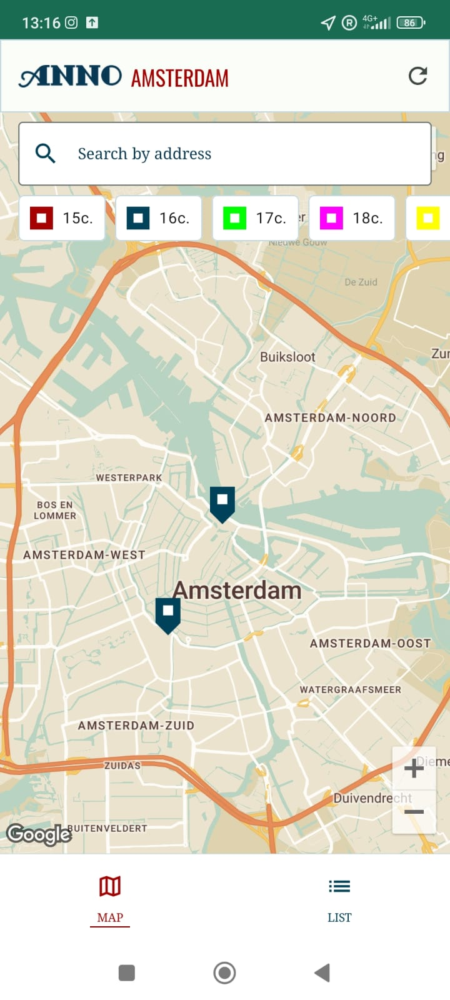
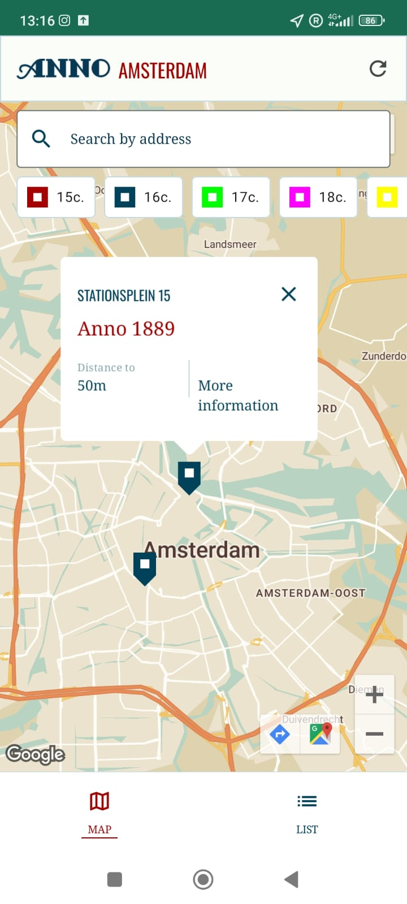
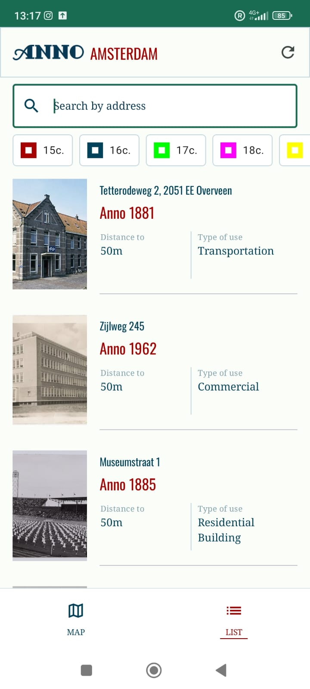
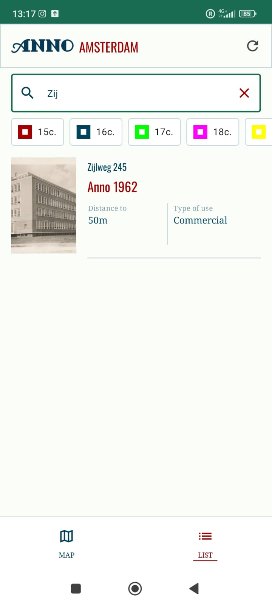
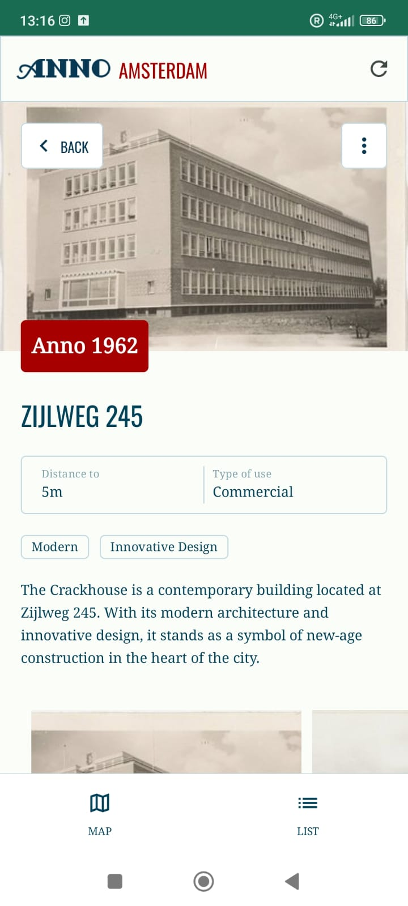

# Anno Amsterdam - iOS SwiftUI

A mobile application for the residents & tourists of Amsterdam to discover and learn more about the historic buildings using AR.

## Screenshots

<table>
  <tr>
    <td align="center" width="33%">
       
      <em>Map page of historical buildings</em>
    </td>
    <td align="center" width="33%">
       
      <em>Buidling preview of an marker</em>
    </td>
    <td align="center" width="33%">
       
      <em>List page of historical buildings</em>
    </td>
  </tr>
  <tr>
    <td align="center" width="33%">
       
      <em>Search results at the list page</em>
    </td>
    <td align="center" width="33%">
       
      <em>Details page</em>
    </td>
    <td align="center" width="33%">
       
      <em>Image details page</em>
    </td>
  </tr>
</table>

## Clients Vision

The history about buildings in Amsterdam
To view them …
- on an Map
- in an List
- in detail
The ability to …
- filter by centuries 
- search by address 
- have an onboarding

## Setup

Go to Google Cloud Console, create a new project, add Google Maps API & generate an api key and set this one in the AndroidManifext.xml
https://developers.google.com/maps/documentation/android-sdk/get-api-key

​

​

​

​
